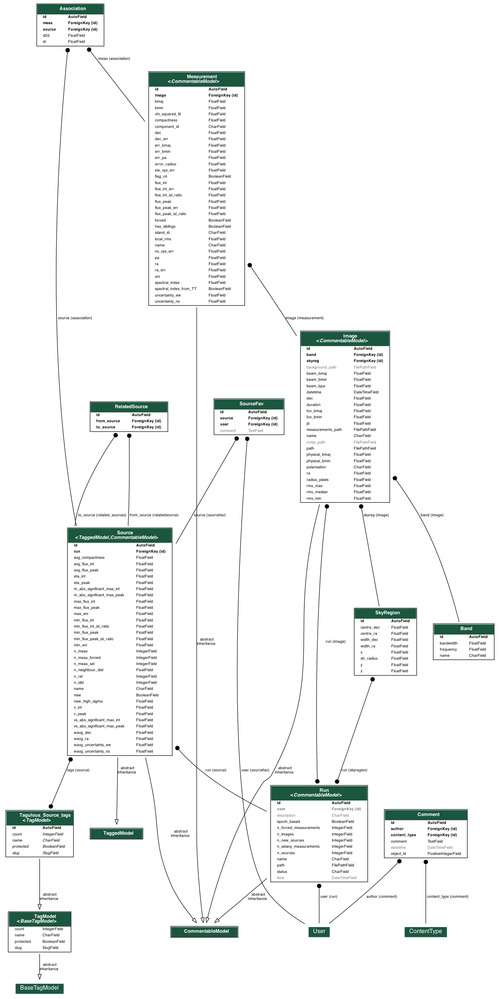

# Database Schema

This section describes the relationships between the objects/tables stored in the database.

## Django Web App Schema

The following figure shows a detailed schematics of the schema and relationships as well as tables parameters of the Django App.

[{: loading=lazy }](../img/schema.png)

## Pipeline Detailed Schema

A details to the pipeline schema is shown below:

[{: loading=lazy }](../img/schema_pipeline.png)

### Important points

Some of the key points of the above relationship diagram are:

* sfd

## Pipeline Tables Description
