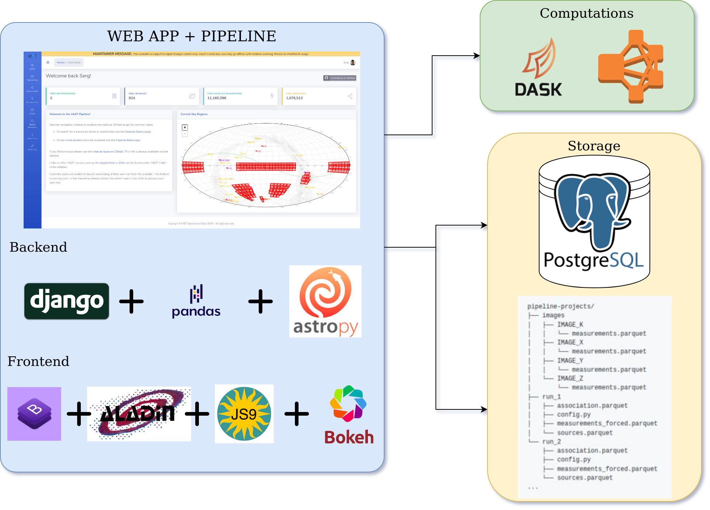

# VAST Pipeline Architecture

The pipeline is essentially a [Django app](https://www.djangoproject.com/) in which the pipeline is run as a Django admin command. The main structure of the pipeline is described in this schematics:

[{: loading=lazy }](../img/vast_pipeline_architecture.png)

## Design Philosophy

We design the pipeline in order to make it easy to use but at the same time powerful and fast. We decided to use the familiar Pandas Dataframe structure to wrap all the data manipulations, including the association operations, in the back-end. The Python community, as well as the research and scientific communities (including the astro-physicists) are very familiar with Pandas, and they should be able to understand, mantain and develop the code base.

Usually in the "Big Data" world the commond tools adopted by the industry and research are [Apache Hadoop](https://hadoop.apache.org/) and [Spark](https://spark.apache.org/). We decided to use [Dask](https://dask.org/) which is similar to Spark in same ways, but it integrates well with Pandas Dataframe and its syntax is quite similar to Pandas. Further it provides scalability by means of clustering and integrating with HPC (High Performance Comptuing) stacks.

The pipeline code itself and the web app are integrated into one code base, for the sake of simplicity, easy to develop using one central repository. The user can still run the pipeline via CLI (Command Line Interface), using [Django Admin Commands](https://docs.djangoproject.com/en/3.1/howto/custom-management-commands/), as well as thorugh the web app itself. The integration avoid duplication in code, especially on regards the declaration of the schema in the ORM (Object Relational Mapping), and add user and permission management on the underlyng data, through the in-built functionality of Django framework.

The front-end is built in simple HTML, CSS and Javascript using a freely available Bootstrap 4 template. The developers know best practices in the web development are focusing mostly on single page applications using framework such as [ReactJS](https://reactjs.org/) and [AngularJS](https://angular.io/). The choice of using just the basic web stack (HTML + CSS + JS) was driven by the fact that future developers do not need to learn modern web frameworks such as React and Angular, but the fundamental web programming which is still the core of those tools.

## Technology Stack

### Back-End

* [Astropy 4+](https://www.astropy.org/)
* [Astroquery 0.4+](https://astroquery.readthedocs.io/en/latest/)
* [Bokeh 2+](https://docs.bokeh.org/en/latest/index.html)
* [Dask 2+](https://dask.org/)
* [Django 3+](https://www.djangoproject.com/)
    * [Django Rest Framework](https://www.django-rest-framework.org/)
    * [Rest Framework Datatables](https://django-rest-framework-datatables.readthedocs.io/en/latest/)
    * [Django Q](https://django-q.readthedocs.io/en/latest/)
    * [Python Social Auth - Django](https://github.com/python-social-auth/social-app-django)
    * [Django Crispy Forms](https://django-crispy-forms.readthedocs.io/en/latest/index.html)
    * [Django Tagulous](https://github.com/radiac/django-tagulous)
* [Pandas 1+](https://pandas.pydata.org/)
* [Python 3.6+](https://www.python.org/)
* [Pyarrow 0.17+](https://arrow.apache.org/docs/python/install.html)
* [Postgres 10+](https://www.postgresql.org/)
    * [Q3C](https://github.com/segasai/q3c)
* [Vaex 3+](https://vaex.readthedocs.io/en/latest/)

### Front-End

* [Aladin Lite](https://aladin.u-strasbg.fr/AladinLite/)
* [Bokeh](https://docs.bokeh.org/en/latest/index.html)
* [Bootstrap 4](https://getbootstrap.com/)
* [DataTables](https://datatables.net/)
* [D3 Celestial](https://github.com/ofrohn/d3-celestial)
* [Jquery](https://jquery.com/)
* [JS9](https://js9.si.edu/)
* [ParticleJS](https://vincentgarreau.com/particles.js/)
* [PrismJS](https://prismjs.com/)
* [SB Admin 2 template](https://github.com/StartBootstrap/startbootstrap-sb-admin-2)

### Additional

* [Docker](https://www.docker.com/)
* [node 12+](https://nodejs.org/en/)
* [npm 6+](https://www.npmjs.com/)
* [gulp 4+](https://gulpjs.com/)
* [GitHub Actions](https://github.com/features/actions)
