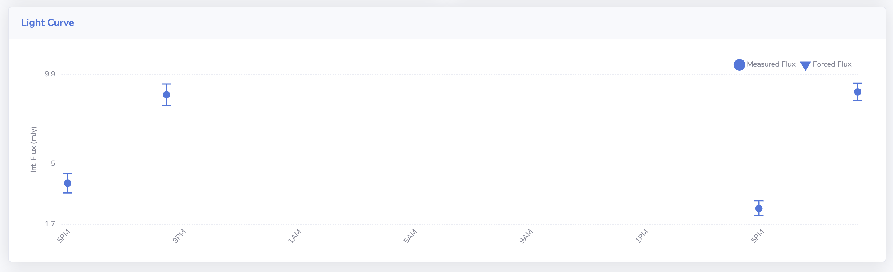

# Source Association

This page details the association stage of a pipeline run.

There are three association methods available which are summarised in the table below, and detailed in the following sections.

!!! tip
    For complex fields and large surveys the `De Ruiter` method is recommended.

| Method                         | Fixed Assoc. Radius      | Astropy function       | Possible Relation Types |
| ------------------------------ | ------------------------ | ---------------------- | ----------------------- |
| [Basic](#basic)                |         Yes              | `match_coordinates_sky` | one-to-many |
| [Advanced](#advanced)          |         Yes              | `search_around_sky`    | many-to-many, many-to-one, one-to-many |
| [de Ruiter (TraP)](#de-ruiter) |         No               | `search_around_sky`    | many-to-many, many-to-one, one-to-many |


## General Association Notes

### Terminology

During association, `measurements` are associated into unique `sources`.

### Association Process

By default, association is performed on an image-by-image basis, ordered by the observational date. The only time this isn't the case is when [Epoch Based Association](#epoch-based-association) is used.

!!! note
    Epoch Based Association is not an association method, rather it changes how the measurements are handled when passed to one of the three methods for association.

### Weighted Average Coordinates

For each association method, after every iteration, the weighted average RA and Dec are calculated for each source. These weighted averages are then used as the base catalogue for the next association iteration. In other words, as the measurements are associated, new meausrements are associated against the weighted average of the sources identified to that point in the process.

Sources positions are reported using the weighted averages.

## Association Methods

!!! tip
    For a better understanding on the underlying process, see [this page](https://docs.astropy.org/en/stable/coordinates/matchsep.html#matching-catalogs) in the astropy documentation for examples on matching catalogues.

### Basic
The most basic association method uses the astropy [`match_coordinates_sky`](https://docs.astropy.org/en/stable/api/astropy.coordinates.match_coordinates_sky.html) function which:

* Associates measurements using only the nearest neighbour for each source when comparing catalogues.
* Uses a fixed association radius as a threshold for a 'match'.
* Only one-to-many [relations](#relations) are possible.

### Advanced
This method uses the same process as `Basic`, however the astropy function [`search_around_sky`](https://docs.astropy.org/en/stable/api/astropy.coordinates.search_around_sky.html) is used instead. This means:

* All possible matches between the two catalogues are found, rather than only the nearest neighbour.
* A fixed association radius is still applied as the threshold.
* All types of [relations](#relations) are possible.

### de Ruiter
The de Ruiter method is a translation of the association method used by the [LOFAR Transients Pipeline (TraP)](https://tkp.readthedocs.io/en/latest/), which uses the `de Ruiter radius` in order to define associations. 

The `search_around_sky` astropy method is still used, but the threshold for a potential match is first limited by a `beamwidth limit` value which is defined in the pipeline run configuration file (`ASSOCIATION_BEAMWIDTH_LIMIT`), such that the initial threshold separation distance is set to

$$
\text{beamwidth limit} \times \frac{\theta_{\text{bmaj,img}}}{2},
$$

where $\theta_{\text{bmaj,img}}$ is the major axis of the restoring beam of the image being associated. Then, the de Ruiter radius is calculated for all potential matches which is defined as

$$
r_{i,j} = \sqrt{
  \frac{ (\alpha_{i} - \alpha_{j})^{2}((\delta_{i} + \delta_{j})/2)}{\sigma^{2}_{\alpha_{i}} + \sigma^{2}_{\alpha_{j}}}
  + \frac{(\delta_{i} + \delta_{j})^{2}}{\sigma^{2}_{\delta_{i}} + \sigma^{2}_{\delta_{j}}}
}
$$

where $\alpha_{n}$ is the right ascension of source n, $\delta_{n}$ is its declination, and $\sigma_{y}$ represents the error on the quantity y. Matches are then identified by applying a threshold maximum value to the de Ruiter radius which is defined by the user in the pipeline run configuration file (`ASSOCIATION_DE_RUITER_RADIUS`).

All relation types are possible using this method.

## Relations
Situations can arise where a source is associated with more than one source in the catalogue being cross-matched (or vice versa). Internally these types of associations are called:

* `many-to-many`
* `one-to-many`
* `many-to-one`

a good explanation of these situations is presented in the TraP documentation [here](https://tkp.readthedocs.io/en/latest/devref/database/assoc.html#database-assoc). The VAST Pipeline follows the TraP methods in handling these types of associations, which is also detailed in the linked documentation. In short:

* `many-to-many` associations are reduced to `one-to-one` or `one-to-many` associations.
* `one-to-many` and `many-to-one` associations create "forked" unique sources. I.e. an individual datapoint can belong to two different sources.

The VAST Pipeline reports the `one-to-many` and `many-to-one` associations by `relating` sources. A source may have one or more `relations` which signifies the the source could be associated with more than one other source. This often happens for complex sources with many closely packed components.

A read-through of the [TraP documentation](https://tkp.readthedocs.io/en/latest/devref/database/assoc.html#database-assoc) is highly encouraged on this point as it contains an excellent description.

## Epoch Based Association
The pipeline is able to associate inputs on an epoch basis. What this means is that, for example, all VAST Pilot Epoch 1 measurements are grouped together and are associated with grouped together Epoch 2 measurements, and so on. In doing this, duplicate measurements from within the same epoch are cut with the measurement kept being that which is closest to the centre of its respective image. The separation distance that defines a duplicate is defined in the pipeline run configuration file (`ASSOCIATION_EPOCH_DUPLICATE_RADIUS`). 

The mode is activated by entering the images to be processed as `dictionary` objects, using an orderable string as the key and lists of images as the values, as demonstrated below.

```python
IMAGE_FILES = {
    "epoch01": ["/full/path/to/image1.fits", "/full/path/to/image2.fits"], 
    "epoch02": ["/full/path/to/image3.fits"],
}
``` 

The lightcurves below show the difference between 'regular' association (top) and 'epoch based' association (lower) for a source.

[{: loading=lazy }](../img/regular_association.png)
[{: loading=lazy }](../img/epoch_based_association.png)

For large surveys where transient and variablity searches on the epoch timescale is required, using this mode can greatly speed up the association stage.

!!! warning
    Epoch based association does eliminate the full time resolution of your data! The base time resolution will be between the defined epochs.

## Parallel Association
When parallel association is used, the images to process are analysed and grouped into distinct patches of the sky that do not overlap. These distinct regions are then processed through the source association in parallel. It is recommended to use parallel association when your dataset covers three or more distinct patches of sky.


