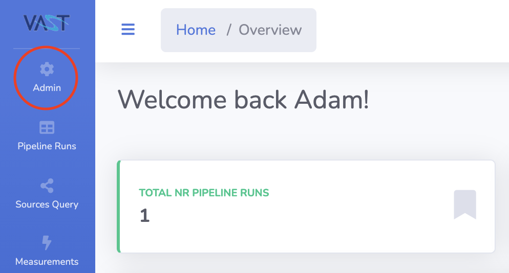
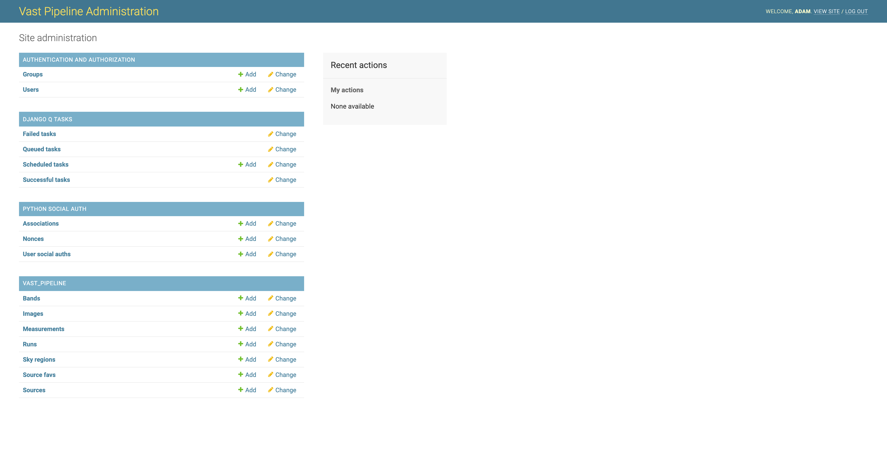

# Website Admin Tools

## Accessing the Admin Tools

Users designated as administrators of the pipeline instance being explored (controlled by GitHub team membership) 
will be able to see the admin button at the top of the navbar as shown below.

[{: loading=lazy }](../img/admin-navbar.png)

Clicking this button and then selecting the `Django` open will take the user to the Django admin backend interface shown below.

[{: loading=lazy }](../img/admin-homepage.png)

## Authentification and Authorization

This section allows for the management of the user accounts and groups. Here users can be made admins and details such as email address updated.

## Django Q Tasks

This area allows for the management of the `Django Q` processing queue. Admins are able to cancel scheduled tasks, view failed tasks or schedule new tasks.

## Python Social Auth

The area for managing aspects of the authentification system that allows users to log in via GitHub.

## VAST_PIPELINE

Admins are able to interact with the pipeline results data that has been uploaded from pipeline runs. This includes editing and removing objects or fields in the data as well as tags and comments.
