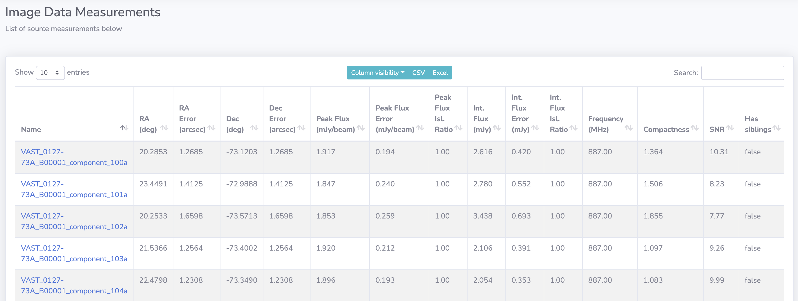
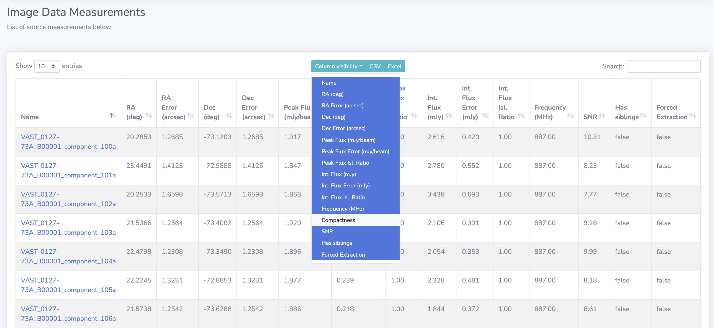

# DataTables

Much of the data is presented using tables that share consistent functionality across the website. 
An example of a table is shown below, note the interactive features across the top of the table, these are explained after the screenshot.

{: loading=lazy }

* **Show 10 entries**: A selectable limiter of how many rows to display at once (maximum 100).
* **Column visibility**: Enables the user to hide and show columns columns. In the screenshot below the `compactness` column is hidden by deselecting it in the presented list. 
    {: loading=lazy }
* **CSV**: Will download a CSV file of the data currently shown on screen.
* **Excel**: Will download an Excel file of the data currently shown on screen.

    !!! warning
        Note the statement **currently shown on screen** - only this data will be downloaded to the CSV and Excel files. All the records are not able to be downloaded
        in this manner - for this it is recommened to interact with the output [parquet files](../outputs/outputs.md).
        
* **Search**: A search bar for the user to filter the table to the row they require. The search will take into account all appropriate columns when searching.