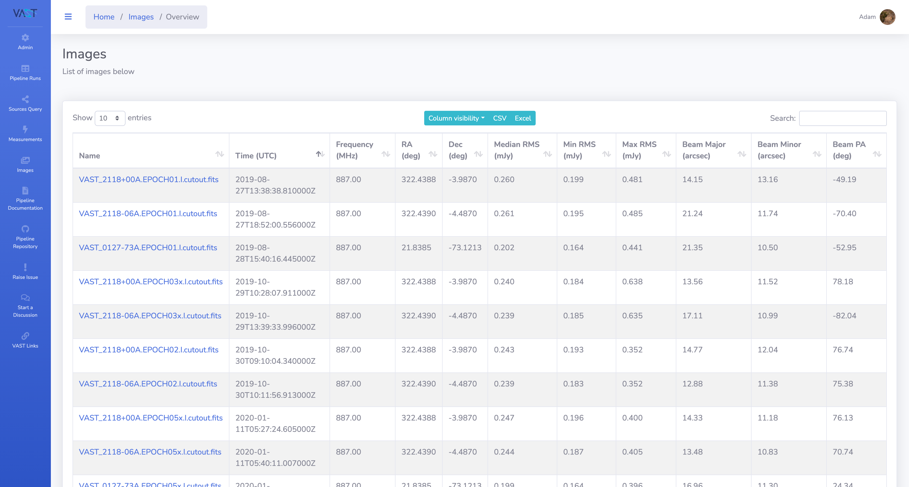
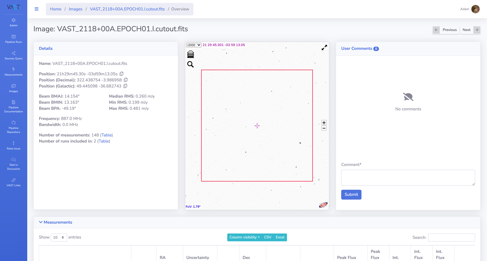
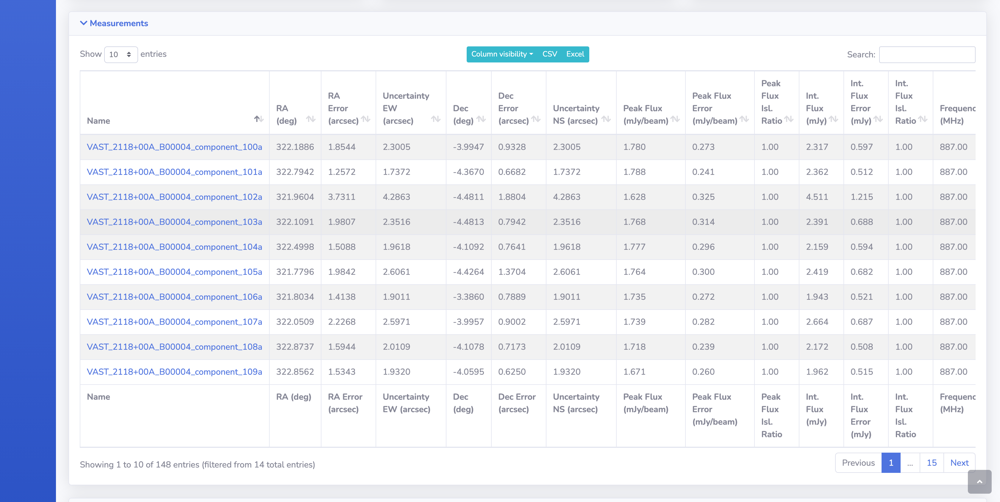
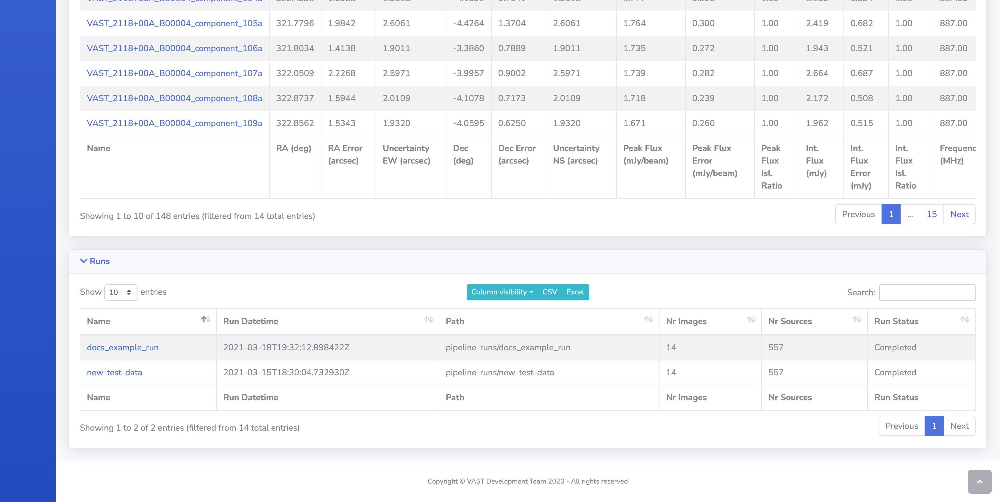

# Image Pages

This page details the website pages for information on the images.

## List of Images

Shown on this page is a list of images that have been ingested into the pipeline database from **all** pipeline runs, along with their statistics.
From this page the full detail page of a specific image can be accessed by clicking on the image name. 
Explanation of the table options can be found in the [DataTables section](datatables.md).

{: loading=lazy }

## Image Detail Page

This page presents all the information about the selected image.

{: loading=lazy }

### Previous & Next Buttons

These buttons do the following:

* **Previous**: Navigates to the previous image by `id` value.
* **Next**: Navigates to the next image by `id` value.

### Details

A text representation of details of the image.

### Aladin Lite Viewer

[Aladin Lite Documentation](https://aladin.u-strasbg.fr/AladinLite/doc/){ target=_blank }.

The central panel contains an Aladin Lite viewer, which by default displays the HIPS image from the [Rapid ASKAP Continuum Survey](https://research.csiro.au/racs/){ target=_blank }, centred on the image central coordinates of the image.
Other surveys are available such as all epochs of the VAST Pilot Survey (including Stokes V) and other wavelength surveys such as 2MASS.
The red square shows the footprint of the image sky region on the sky.

### User Comments

Users are able to read and post comments on an image using this form.

### Measurements Table

This table displays all the `Selavy` measurements that were ingested with the image (no forced measurements appear here as they are run specific). 
The measurement detail page can be reached by clicking the measurement name.

{: loading=lazy }

### Pipeline Runs Table

This table displays all the pipeline runs that use the current image. The pipeline detail page can be reached by clicking the run name.

{: loading=lazy }
