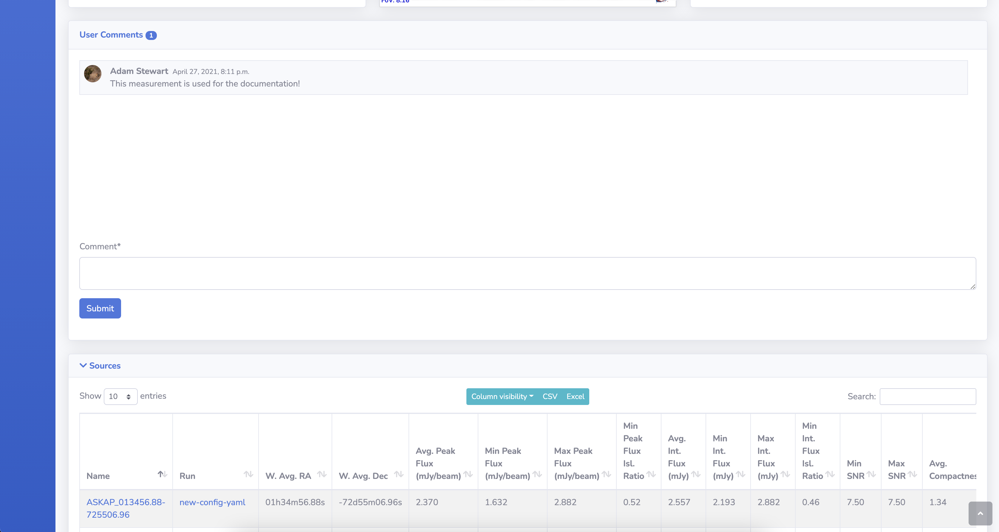

# Measurement Detail Page

This page presents all the information about the selected measurement, including a postage stamp cutout of the component.

{: loading=lazy }

## SIMBAD, NED, Previous & Next Buttons

These buttons do the following:

* **SIMBAD**: Performs a cone search on SIMBAD with a radius of 10 arcmin centered on the measurement location.
* **NED**: Performs a cone search on NED with a radius of 10 arcmin centered on the measurement location.
* **Previous**: Navigates to the previous measurement by `id` value.
* **Next**: Navigates to the next measurement by `id` value.

## Details

A text representation of details of the measurement.

## Aladin Lite Viewer

[Aladin Lite Documentation](https://aladin.u-strasbg.fr/AladinLite/doc/){ target=_blank }.

The central panel contains an Aladin Lite viewer, which by default displays the HIPS image from the [Rapid ASKAP Continuum Survey](https://research.csiro.au/racs/){ target=_blank }, centred on the location of the measurement.
Other surveys are available such as all epochs of the VAST Pilot Survey (including Stokes V) and other wavelength surveys such as 2MASS.

## JS9 Viewer

[JS9 website](https://js9.si.edu){ target=_blank }.

The right panel contains a JS9 viewer showing the postage stamp FITS image of the measurement loaded from its respective image FITS file.

!!! note
    If the image data is removed from its location when the pipeline run was processed the JS9 viewer will no longer work.

## User Comments

Users are able to read and post comments on a measurement using this form.

{: loading=lazy }

## Sources Table

The sources table shows all the sources, from all pipeline runs, that the measurement is associated to.
Explanation of the table options can be found on the overview page [here](websiteoverview.md#data-tables).

{: loading=lazy }

## Siblings Table

The siblings table displays all other measurements that are a sibling of the current measurement, i.e., the measurements belong to the same island (as determined by `Selavy`).
