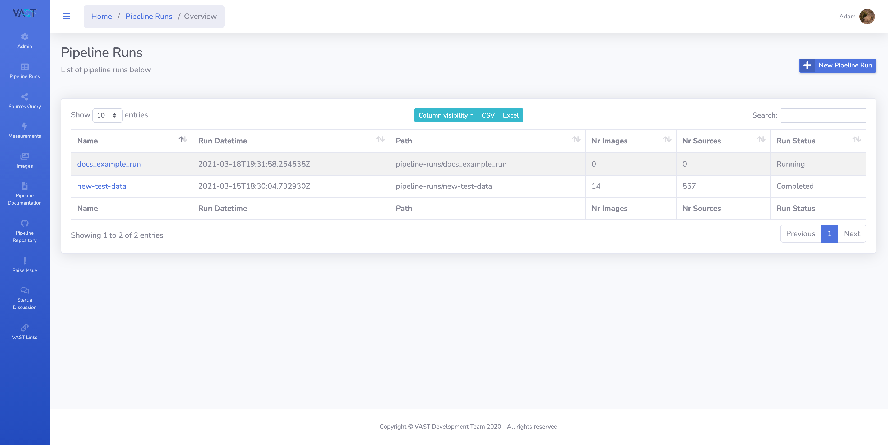
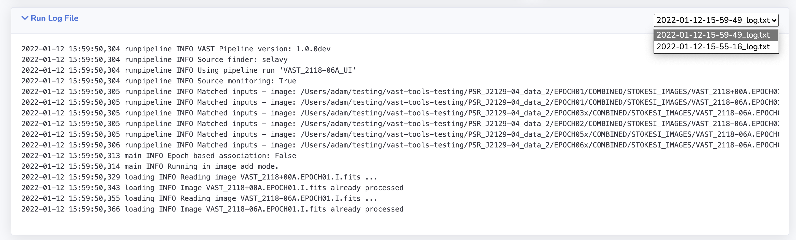

# Pipeline Run Pages

This page details the website pages for information on the pipeline runs.

## List of Pipeline Runs

A list of the pipeline runs that have been processed or initialised are presented on this page along with basic statistics, including the run status.
From this page the full detail page of a specific pipeline run can be accessed by clicking on the name of the pipeline run. 
Explanation of the table options can be found on the overview page [here](websiteoverview.md#data-tables).

[{: loading=lazy }](../img/pipeline-runs.png)

## Pipeline Run Detail Page

This page presents all the information about the pipeline run, including options to edit the configuration file and to schedule the run for processing.

!!! note
    For full details on how to process a run please refer to [this page](../using/processrun.md).

[{: loading=lazy }](../img/run-detail1.png)

### Summary Cards
The cards at the top of the page give a summary of the total numbers of:

* Images in the pipeline run.
* Measurements in the pipeline run.
* Sources in the pipeline run.
* New sources in the pipeline run.

Clicking on the total number of images or measurements will navigate the user to the [Image and Measurements tables](#image-and-measurements-tables) on this page, 
where as the source cards will take the user to the [Sources Query](sourcepages.md#source-query-page) page.

!!! warning
    When sent to the source query page, the user should make sure to click submit on the search.

### Details

A text representation of details of the pipeline run.

### Run Sky Regions

A sky map showing the area of sky covered by the images associated with the pipeline run.

### Configuration File

[{: loading=lazy }](../img/run-detail2.png)

Here the pipeline run configuration file can be viewed, edited and validated.

#### Editing the Configuration File

[{: loading=lazy align=right width=350px}](../img/run-detail3.png)

To edit the configuration file first select the `Toggle on/off Config Edit` option, that is shown in the screenshot to the right. 
This will enter edit mode on the configuration file as denoted by the `--Edit Mode--` message shown in the screenshot below. 

!!! warning
    Do not toggle off edit mode without first selecting `Wrtie Current Config` otherwise changes will be lost.

[{: loading=lazy }](../img/run-detail6.png)

When all changes are applied, select the `Write Current Config` to save the changes.

#### Validating the Configuration File

From the configuration file menu select the `Validate Config` option. 
A feedback modal will then appear with feedback stating whether the configuration validation was successful or failed.
The feeback may take a moment to appear as the check is performed.

[{: loading=lazy }](../img/run-detail7.png)

### User Comments

Users are able to read and post comments on a pipeline run using this form.

### Log File

[{: loading=lazy }](../img/run-detail4.png)

The full log file of the pipeline run is able to viewed.

### Image and Measurements Tables

Two tables are on the pipeline run detail page displaying the images and measurements (including forced measurements) that are part of the pipeline run.
