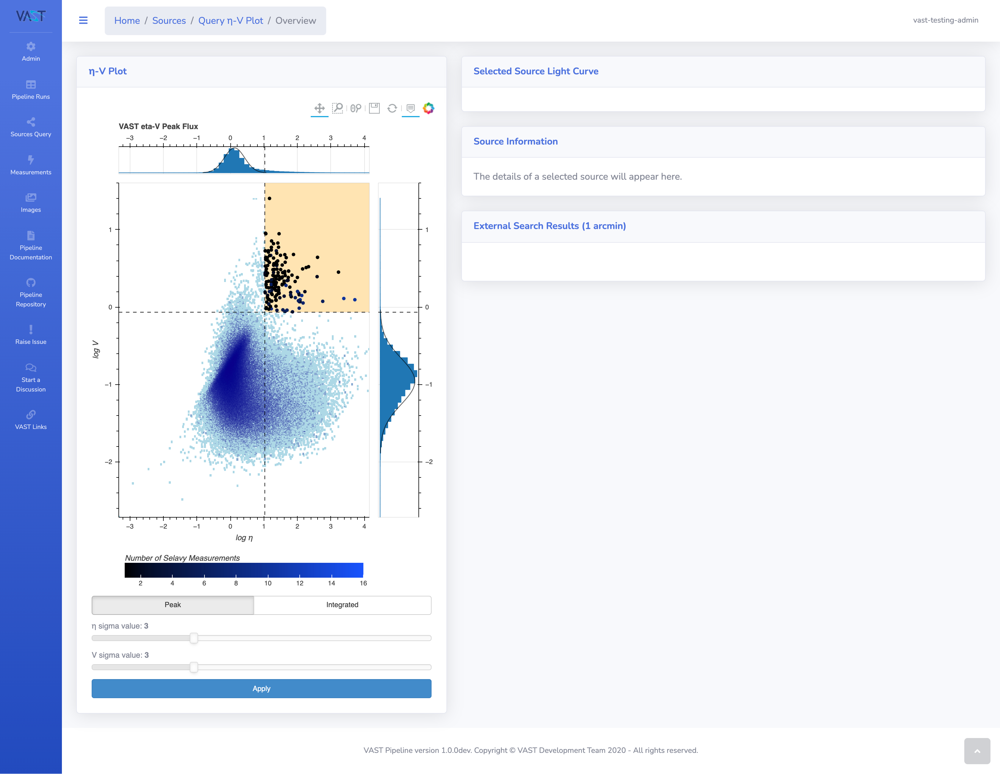

# Source η-V Analysis

This page details the interactive analysis tool of the _η_ and _V_ metrics for a selection of sources.

!!! info "Further Reading"
    Descriptions of the η and V metrics can be found on the [source statistics page](../../design/sourcestats#v-and-metrics).
    
    For a detailed overview of the method, please refer to [Rowlinson et al., 2019](https://ui.adsabs.harvard.edu/abs/2019A%26C....27..111R/abstract){:target="_blank"}.

The analysis can be performed on the results of a [source query](sourcequery.md).

!!! tip "Tip: Sensible Querying!"
    To get the most out of the tool is advised to design a query that will eliminate as many erroneous results as possible.
    For example, making sure sources are isolated and have no siblings or relations.
    The [VAST Tools](https://vast-survey.org/vast-tools/){:target="_blank"} package should be used for more advanced queries.

## Accessing the Analysis Page

Once a query has been performed on the [source query page](sourcequery.md) the `Go to η-V analysis` button will be active as highlighted in the image below.

{: loading=lazy }

Click this button and the analysis page will open.

!!! warning "Warning: Bad Sources"
    Bad sources for analysis will be automatically removed.
    These include sources that only have one datapoint or where the _η_ and/or _V_ are equal to 0 or have failed.

{: loading=lazy }

## η-V Plot Description

Shown on the left side of the page is the the log-log plot of the peak flux η and V metrics of the sources from the query.
The distributions of the metrics are fitted with a Gaussian, and a sigma cut is displayed on the plot that by default is set to a value of $3\sigma$.
The highlighted region represents the area of plot that is beyond both thresholds, and this is where transient sources will be found.
The colour of the points represent how many detection datapoints the source contains.

### Plot Options

{: loading=lazy }

At the bottom of the plot are options to change both the flux type and the multiplication factor of the sigma cut.
Once the new settings are entered click the `Apply` button and the plot will reload with the new options.

## Viewing Source Light Curves & Information

Hovering over a source on the plot will show an information window that displays the source name, id and the η and V values.

{: loading=lazy }

Clicking on the source will load the light curve, source information and external crossmatching search results into the panels on the right side of the page.
Selecting another source will dynamically update these panels without having to leave the page.

{: loading=lazy }

The source information panel contains a link to go to the full [source detail page](sourcedetail.md) and the ability to [favourite a source](sourcetagsfavs.md) directly from this page.

## Displaying High Source Counts

When querying large pipeline runs it is possible that a query will return tens of thousands of results.
Plotting such a high number of sources is very intensive and would take a significant amount of time to render.
To solve this, when a high number of sources are requested to be plotted, all the sources outside of the threshold transient area are plotted as a static image that represents the distribution of the sources.
These sources are not interactive. 
By default the threshold is set to 20,000 datapoints and is [configurable by the administrator](../gettingstarted/configuration.md#.env-file).

Any sources that fall within the transient threshold region are plotted as normal and are interactive as with the standard plot.

!!! warning "Warning: Setting Low Thresholds"
    Setting low thresholds with high source counts could cause a significant amount of candidates to be plotted with the normal method.
    This may result in the plot taking up to a few minutes to load within the browser.

!!! note "Note: Colour Bar"
    The colour bar only applies to the interactive datapoints.

{: loading=lazy }
