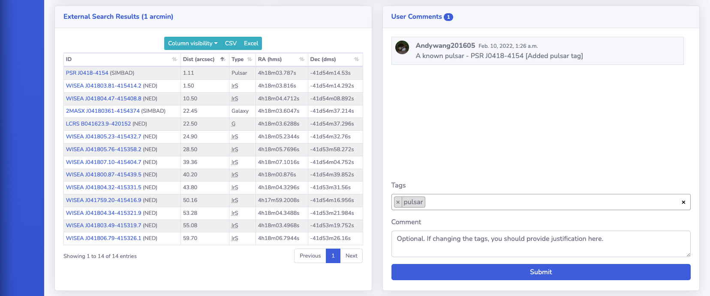
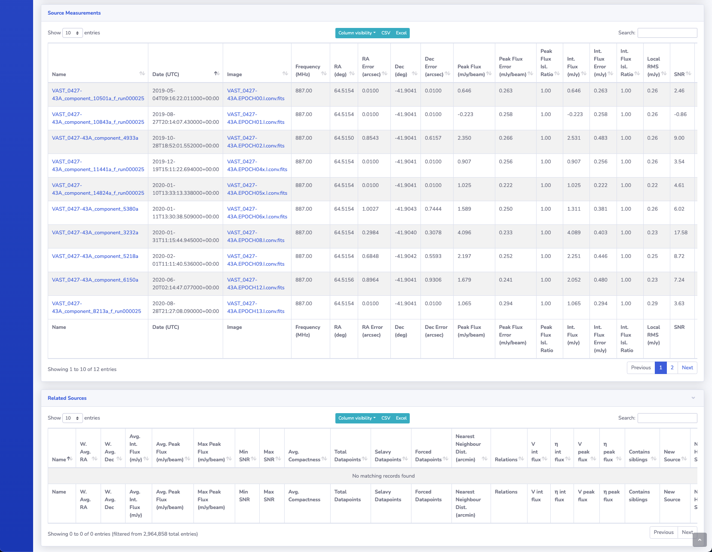

# Source Detail

This page presents all the information about the selected source, including a light curve and cutouts of all the measurements that are associated to the source.

{: loading=lazy }

## Star, SIMBAD, NED, Previous & Next Buttons

These buttons do the following:

* **Star**: Adds the source to the user's favourites, see [Source Tags and Favourites](sourcetagsfavs.md).
* **SIMBAD**: Performs a cone search on SIMBAD with a radius of 10 arcmin centered on the source location.
* **NED**: Performs a cone search on NED with a radius of 10 arcmin centered on the source location.
* **Previous**: Navigates to the previous source that was returned in the source query.
* **Next**: Navigates to the next source that was returned in the source query

## Details

A text representation of details of the measurement.

## User Comments & Tags

Users are able to read and post comments on a measurement using this form, in addition to adding and removing tags, see [Source Tags and Favourites](sourcetagsfavs.md).

## Aladin Lite Viewer

[Aladin Lite Documentation](https://aladin.u-strasbg.fr/AladinLite/doc/){ target=_blank }.

The central panel contains an Aladin Lite viewer, which by default displays the HIPS image from the [Rapid ASKAP Continuum Survey](https://research.csiro.au/racs/){ target=_blank }, centred on the location of the source.
Other surveys are available such as all epochs of the VAST Pilot Survey (including Stokes V) and other wavelength surveys such as 2MASS.

## Light Curve

The light curve of the source is shown. The peak or integrated flux can be selected by using the radio selection buttons.

{: loading=lazy }

{: loading=lazy align=right }

Hovering over the data points on the light curve will show an information panel that contains the date of the measurement, the flux and the measurement number.
It also contains a thumbnail image preview of the respective measurement.

## Two-epoch Node Graph

The node graph is a visual representation of what two-epoch pairings have significant variability metric values. 
If an epoch pairing is significant then they are joined by a line on the graph. Hovering over the line will highlight the epoch pairing on the light curve plot.

## External Search Results Table

This table shows the result of a query to the SIMBAD, NED, and TNS services for astronomical sources within 1 arcmin of the source location. 
Along with the name and coordinate of the matches, the on-sky separation between the source is shown along with the source type.

## JS9 Viewer Postage Stamps

[JS9 website](https://js9.si.edu){ target=_blank }.

The JS9 viewer is used to show the postage stamp FITS images of the measurements that are associated with the source, loaded from their respective image FITS files.

!!! note
    If the image data is removed from its location when the pipeline run was processed the JS9 viewer will no longer work.

{: loading=lazy }

## Source Measurements Table

This table displays the measurements that are associated with the source. The detail page for the measurement can be reached by clicking the name of the respective measurement.

{: loading=lazy }

## Related Sources Table

This table displays the sources that are a relation of the source in question. For further information refer to the [Relations](../design/association.md#relations) section in the association documentation.
