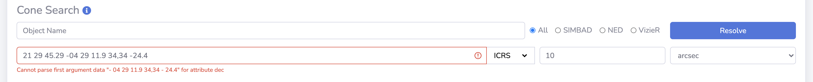
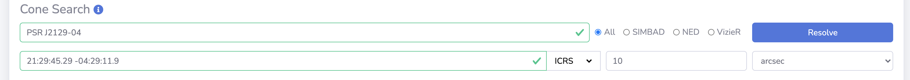
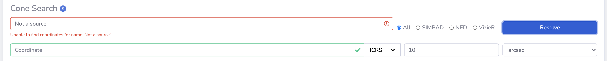

# Source Query

This page details the Source Query interface.

## Query Options

Users can filter and query the sources currently in the database by using the form located on this page. 

The form is submitted by clicking the blue :fontawesome-solid-search: button, the red :fontawesome-solid-trash: button  will reset the form by removing all entered values.
Once the form is submitted the results are dynamically updated in the results table below the form (i.e. on the same page).

The following sections provide further details on the form.

{: loading=lazy }

## Data Source

Here a specific pipeline run can be selected from a dropdown list to filter sources to only those from the chosen run. By default sources from all runs are shown.

!!! note
    Only successfully completed pipeline runs are available to select. This rule also applies when `all` is selected.

## Cone Search

Users can choose whether to input their coordinates directly or use the object name resolver to attempt to fetch the coordinates.

### Manual Input

The format of the coordinates should be in a standard format that is recognised by astropy, for example:

* `21 29 45.29 -04 29 11.9`
* `21:29:45.29 -04:29:11.9`
* `322.4387083 -4.4866389`

Galactic coordinates can also be entered by selecting `Galactic` from the dropdown menu that is set to `ICRS` by default. 
Feedback will be given immediately whether the coordinates are valid, as shown in the screenshots below:

{: loading=lazy }
{: loading=lazy }

Once the coordinates have been entered the radius value must also be specified as shown in the screenshot above. Use the dropdown menu to change the radius unit to be `arcsec`, `arcmin` or `deg`.

### Name Resolver

To use the name resolver, the name of the source should be entered into the `Object Name` field (e.g. `PSR J2129-04`), select the name resolver service and then click the `Resolve` button.
The coordinates will then be automatically filled on a successful match.

{: loading=lazy }

if no match is found then this will be communicated by the form as below:

{: loading=lazy }

## Table Filters

This section of the form allows the user to place thresholds and selections on specific metrics of the sources. 
Please refer to the [Source Statistics page](../design/sourcestats.md) for details on the different metrics. There are also tooltips located on the form to offer explanations.

The following options are not standard source metrics:

### Include and Exclude Tags

Users can attach tags to sources (see [Source Tags and Favourites](sourcetagsfavs.md)) and here tags can be selected to include or exclude in the source search.

### Source Selection

Here specific sources can be searched for by entering the source names, or source database `id` values, in a comma-separated list. For example:

* `J011816.05-730747.77,J011816.05-730747.77,J213221.21-040900.42`
* `1031,1280,52`

are valid entries to this search field. Use the dropdown menu to declare whether `name` (default) or `id` values are being searched.

## Results Table

Located directly below the form is the results table which is dynamically updated once the form is submitted.
The full [detail page](sourcedetail.md) of a specific source can be accessed by clicking on the source name in the table. 
Explanation of the table options can be found in the [DataTables section](datatables.md).
The `Go to η-V analysis` button will launch the η-V analysis page for the sources contained in the query results.
Please refer to the [Source η-V Analysis Page](sourceanalysis.md) section for the full details of this feature.

!!! note
    The `Go to η-V analysis` button is only active after a query has been performed.

{: loading=lazy }

