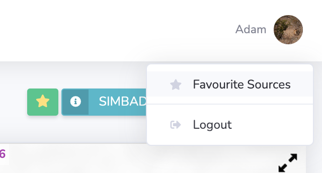
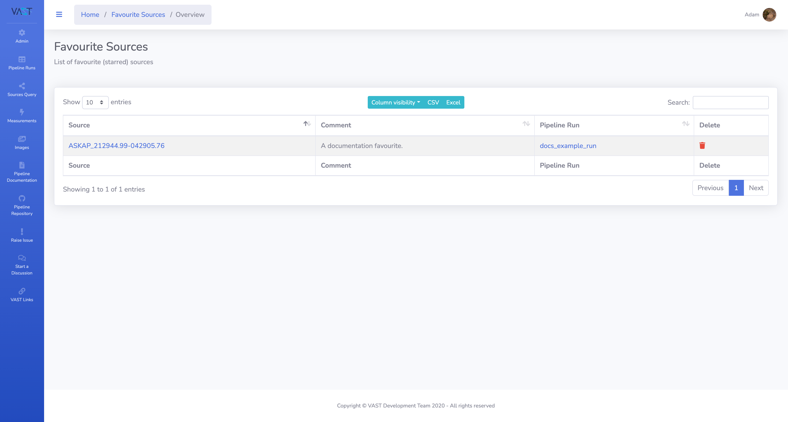
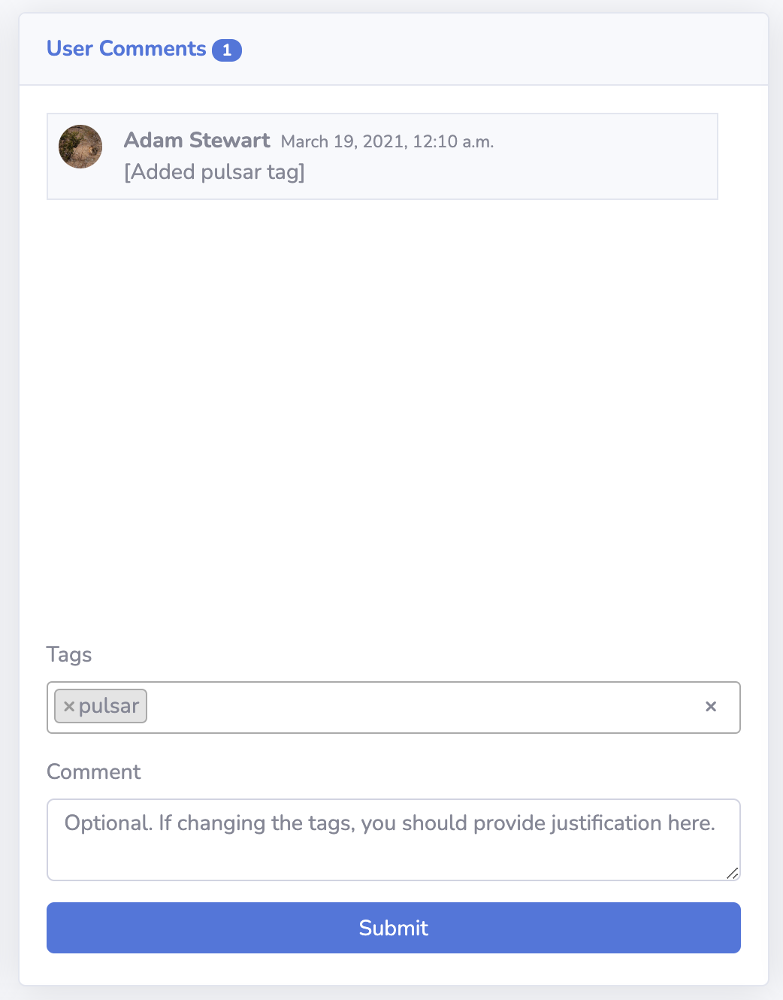

# Source Tags and Favourites

Users are able to save a source as a favourite for later reference, in addition to adding `tags` to sources that can be used in source queries.

## Adding a Source to Favourites

A source can be added to a user's favourites by:

1. Selecting the 'star' button at the top of the source detail page as shown below.

    {: loading=lazy width=600px }
    
2. A modal window will open to confirm the saving of the source as a favourite. An optional comment can be entered.

    {: loading=lazy }

3. Select `Add to Favourites` and a confirmation alert will be shown to signify the source has been added successfully.

    {: loading=lazy width=600px }

## Viewing Favourite Sources

A user can access their favourite sources by selecting the `Favourite Sources` option from the menu when clicking on their username at the top right-hand corner of the page.

{: loading=lazy width=400px }

The user will then be navigated to their favourite sources table as shown below.

{: loading=lazy }

## Adding a Tag

Follow these steps to add a tag to a source:

1. Type the tag to be added into the field tag field. 
2. If the tag has already been used it will appear in the dropdown text options and can be selected by clicking the text. To add a new tag, enter the complete text of the new tag and again click the text in the dropdown text. 
3. After clicking the text the tag will then show as a bordered tag in the input field.
4. Finally, click the submit button (a comment is optional) and the tag will be saved as shown below. A comment will appear stating the addition of the tag.

{: loading=lazy align=left width=350px }
{: loading=lazy align=right width=350px }

## Removing a Tag

Click the `x` on the tag to remove it and then click the `Submit` button to save the removal.

{: loading=lazy width=350px }
