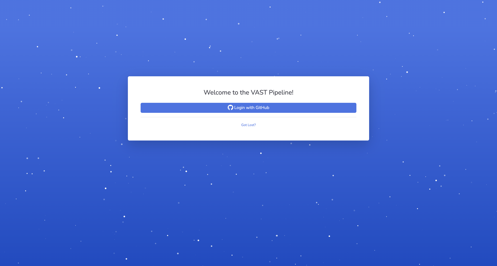
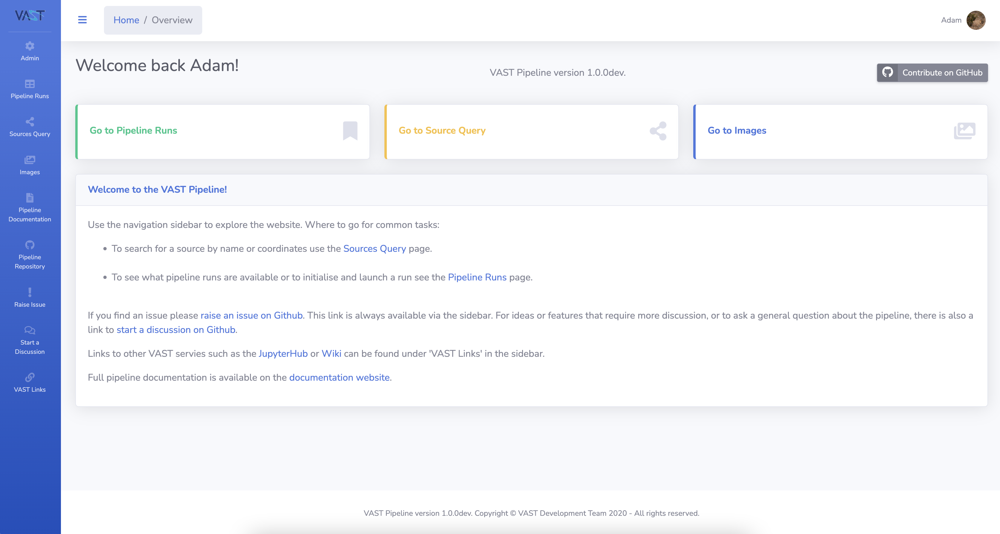

# Accessing the Pipeline

Access to the pipeline website is done using GitHub as the authentification method. In particular it checks organisation membership to confirm that the user is allowed access. For example for those wanting to access the [VAST instance](https://data.vast-survey.org/pipeline/) hosted on Nimbus must make sure they are a member of the [askap-vast](https://github.com/askap-vast) GitHub organisation.

!!! note
    If you are attempting to access an instance of the VAST pipeline not hosted by the VAST group, confirm with the administrator what GitHub organisation membership is required.
    
    Adminstrators can refer to [Pipeline Login](../quickstart/configuration.md#pipeline-login) for information on how to configure the login system.

## Logging In
1. Navigate to the [VAST Pipeline](https://data.vast-survey.org/pipeline/) (or other hosted instance) and the following page will appear.
[{: loading=lazy }](../img/login.png)

2. Click the `Login with GitHub` button and you will be presented with the following page to enter you GitHub details. Note that if you are already logged into GitHub in your browser then you will likely not see this page.
[{: loading=lazy }](../img/signin-github.png)

3. After a successful login you will then be redirected to the Pipeline homepage.
[{: loading=lazy }](../img/homepage.png)

## Troubleshooting

Failures will commonly be caused by the user not being a member of the correct GitHub organisation or an error in the configuration of the login system by the administrator. Contact the administrator of the pipeline instance if you encounter problems logging in.