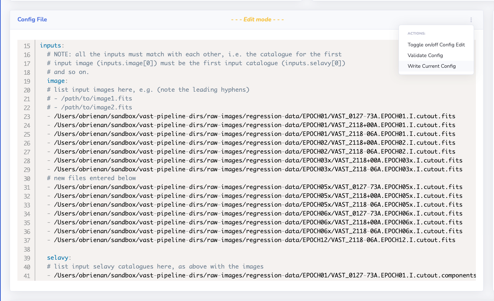

# Adding Images to a Run

This page describes how to add images to a completed run, including how to restore the run to the previous state if an addition goes wrong.

!!! note
    Adding images to an existing run will update the sources already present from the respective run, such that the same source IDs are kept and so to all comments and tags. If a full re-run was used instead then new IDs would be created and the comments and tags lost.
    
    There is no limit on how many times a run can have images added to.

## Step-by-step Guide

!!! warning
    A run must have a `Completed` status before images can be added to it.
    
    No other settings other than the input data can be changed in the config.

### 1. Navigate to the Run Detail Page
Navigate to the detail page of the run you wish to process, and confirm that the job is marked as `Completed`.

[{: loading=lazy }](../img/add-images-detail.png)

### 2. Add the New Images to the Configuration
Scroll to the configuration editor, enter edit mode and add the new images to the existing data inputs. If using epoch mode notation, add a new epoch(s) to the file.

Once all the images, selavy files, rms images and background images have been added, select the `Write Current Config` option to save the file.

!!! warning
    Do not remove the previous images from the configuration inputs or change any other options!
    
    Remember to make sure the order of the new input data is consistent between types!

[{: loading=lazy }](../img/add-images-config.png)

### 3. Perform a Config Validation
Check that the configuration file is still valid by selecting `Validate Config` from the same menu as shown in the previous step 2 screenshot.

### 4. Process the Run
Select the `Add Images or Re-Process Run` button at the top right of the run detail page to open the processing modal window. Select whether to turn debugging log output `On` or `Off` and when ready select the `Schedule Run`.

!!! warning
    Do not toggle `Full Re-Run` to `On`!

You can refresh the page to check the status of the run. You can confirm that the images have been added correctly by consulting the log output found below the configuration file. New images should have been ingested and output similar to the following should be present:

```bash
2021-01-31 12:20:37,885 association INFO Association mode selected: basic.
2021-01-31 12:20:37,975 association INFO Found 2 images to add to the run.
2021-01-31 12:20:37,979 association INFO Association iteration: #1
```

Once the processing has `Completed` the run detail page will now show the updated statistics and information of the run.

[{: loading=lazy }](../img/add-images-finished.png)

## Restore Run to Pre-Add Version
When images are added to a run, a backup is made of the run before proceeding which can be used to restore the run to the pre-addition version. For example, perhaps the wrong images were added or an error occured mid-addition that could not be resolved.

This command is currently unavailable to perform through the website interface but can be performed by an administrator of the pipeline via the command line interface. Please contact the adminstrator for the pipeline instance to request a run restoration.

The command to perform this operation is `restorepiperun` and is described in the admin section [here](../../adminusage/cli/#restoring-a-pipeline-run).
