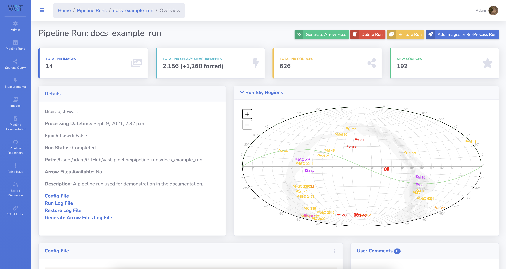
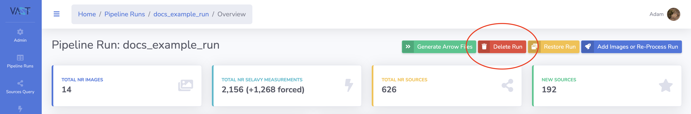
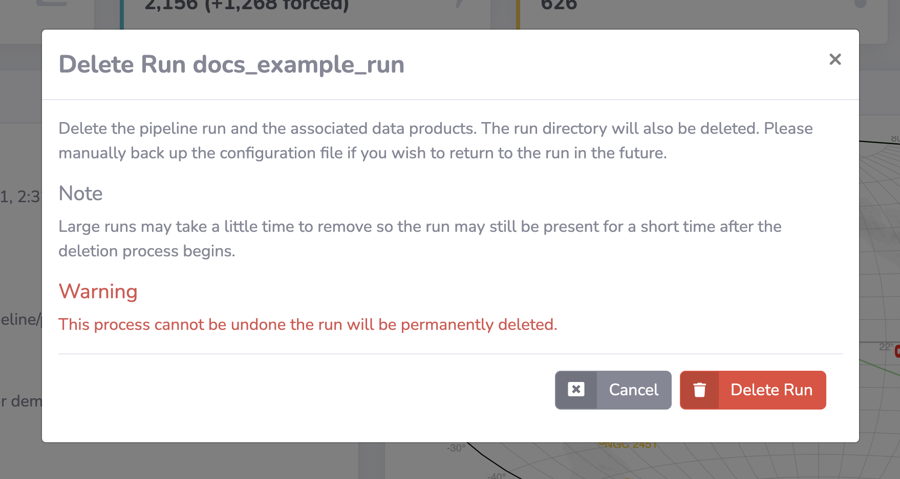
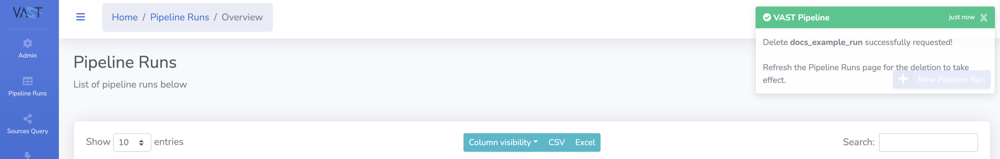
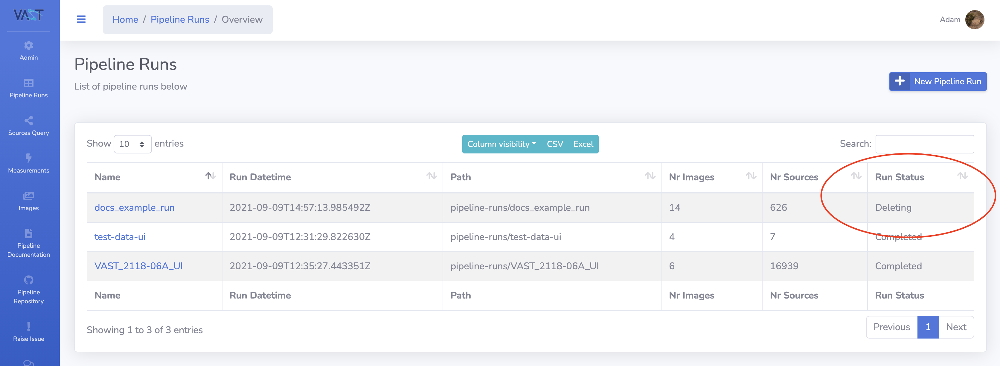

# Deleting a Run

This page describes how to delete a pipeline run through the website interface.

Deleting a run means that all outputs such as sources and associations are deleted from the database and the run itself is also removed.
Images and the accompanying measurements are only removed if they were used solely by the deleted run.
The run directory is also deleted that contains the output files and configuration files.

A pipeline run can only be deleted by the creator or an administrator.

!!! warning
    As stated above, deleting a run through the website will also delete the full run directory, which includes the configuration files.
    Please manually back up the configuration file if you think you are likely to revisit that particular run configuration in the future.

!!! tip "Admin Tip"
    Administrators can refer to the [`clearpiperun`](../adminusage/cli/#clearpiperun) command for details on how to reset a pipeline run via the command line.

## Step-by-step Guide

### 1. Navigate to the Run Detail Page

Navigate to the detail page of the run you wish to delete.

{: loading=lazy }

### 2. Click on the Delete Run Button

Click on the `Delete Run` button at the top right of the page, to open the confirmation modal.

{: loading=lazy }
{: loading=lazy }

### 3. Confirm Deletion

To confirm the deletion click on the `Delete Run` button in the modal.
Once pressed the website will direct back to the `Pipeline Runs` page and a confirmation message will appear in the top right.

!!! note
    Runs with lots of database entries may take a short time to delete.
    Hence, the run may still appear in the pipeline runs list for a short time following the request with a status of `Deleting`.

{: loading=lazy }
Refreshing the page will show a deleting status if the process is still running:
{: loading=lazy }
