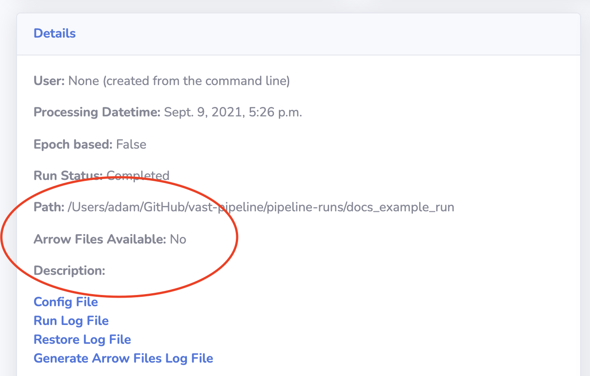
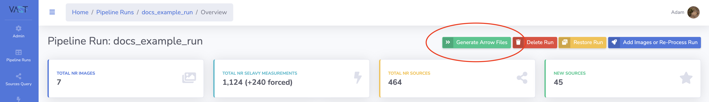
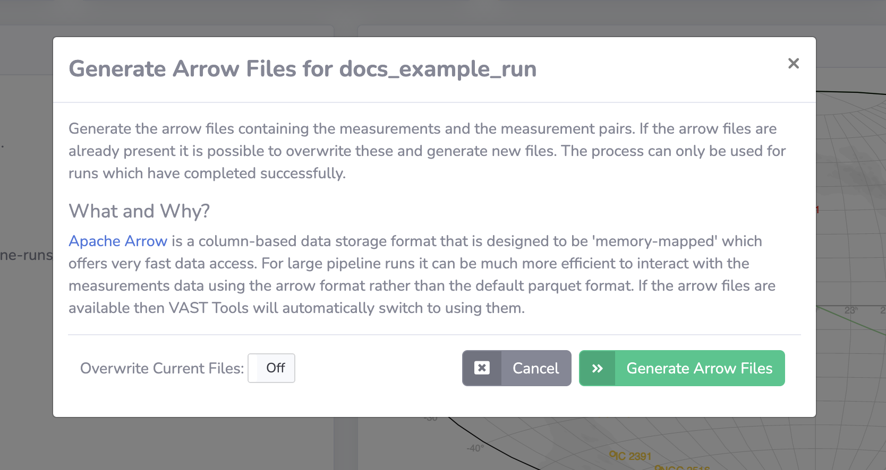
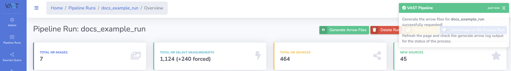
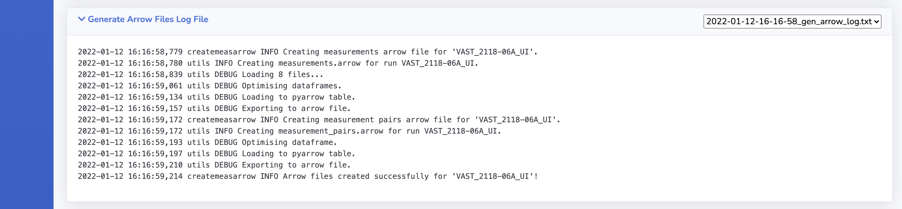

# Generating Arrow Files

This page describes how to generate the measurement arrow files for a pipeline run if the option in the configuration file to create them was turned off.

Arrow files only be generated by the creator or an administrator.

Two files are produced by the method:

| File  | Description |
| ---- | ----------- |
| `measurements.arrow` | An [Apache Arrow](https://arrow.apache.org/overview/){:target="_blank"} format file containing all the measurements associated with the pipeline run (see [Arrow Files](#arrow-files)). Extra processing is performed in the creation of this file such that source ids are already in place for the measurements. |
| `measurement_pairs.arrow` | An [Apache Arrow](https://arrow.apache.org/overview/){:target="_blank"} format file containing all the measurement pair metrics (see [Arrow Files](#arrow-files)). |

!!! tip "Arrow Files Available"
    Users can see if arrow files are present for the run of interest by checking the respective run detail page.
    {: loading=lazy }
    

!!! tip "Admin Tip"
    The arrow files can be generated using the command line using the command [`createmaeasarrow`](../adminusage/cli.md#createmeasarrow)).

## Why Create Arrow Files?

Large pipeline runs (hundreds of images) mean that to read the measurements, hundreds of parquet files need to be read in, and can contain millions of rows.
This can be slow using libraries such as pandas, and also consumes a lot of system memory.

Instead, if the measurements are saved in the [Apache Arrow](https://arrow.apache.org/overview/){:target="_blank"} format, libraries such as [`vaex`](https://vaex.io){:target="_blank"} are able to open `.arrow` files in an out-of-core context so the memory footprint is hugely reduced along with the reading of the file being very fast.
The two-epoch measurement pairs are also saved to arrow format due to the same reasons.

See [Reading with vaex](../../outputs/usingoutputs#reading-with-vaex) for further details on using `vaex`.

## Step-by-step Guide

### 1. Navigate to the Run Detail Page

Navigate to the detail page of the run you wish to generate arrow files for.

{: loading=lazy }

### 2. Select the Generate Arrow Files Option

Click the `Generate Arrow Files` option at the top-right of the page.

{: loading=lazy }

This will open the generate arrow files modal.

{: loading=lazy }

### 3. Submit Generate Arrow Files Request

It is possible to overwrite existing arrow files by toggling the `Overwrite Current Files` option.

When ready, click the `Generate Arrow Files` button on the modal to submit the generate request.
A notification will show to indicate whether the submission was successful.

{: loading=lazy }

### 4. Refresh and Check the Generate Arrow Files Log File

It is possible to check the progress by looking at the Generate Arrow Files Log File which can be found on the run detail page.
The log will not be refreshed automatically and instead the page needs to be manually refreshed.

Once completed the arrow files will be available for use.

{: loading=lazy }
