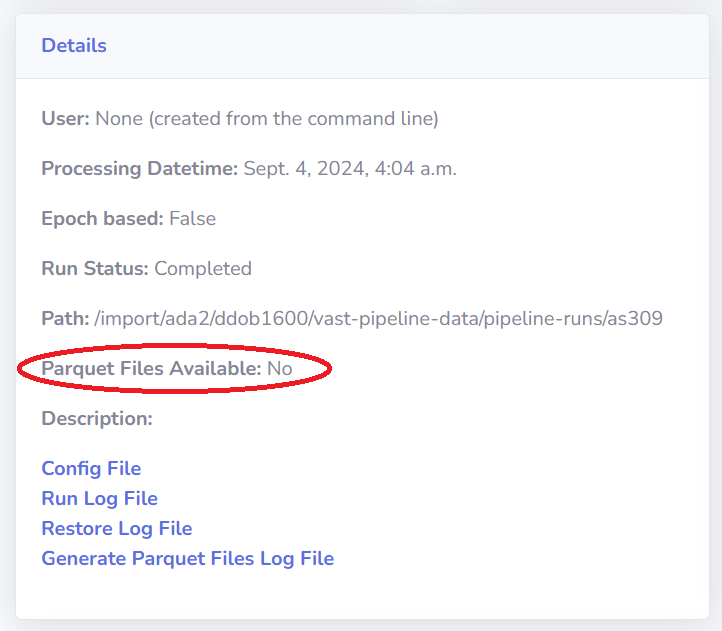
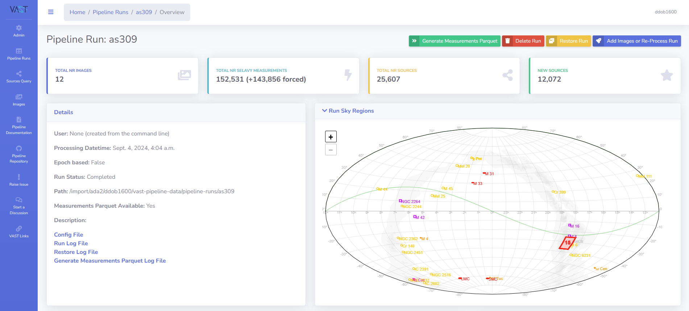
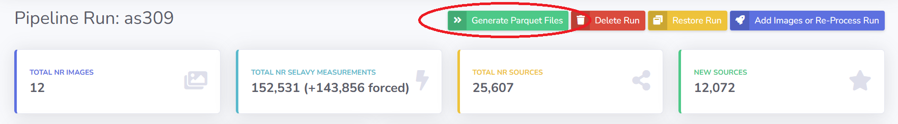
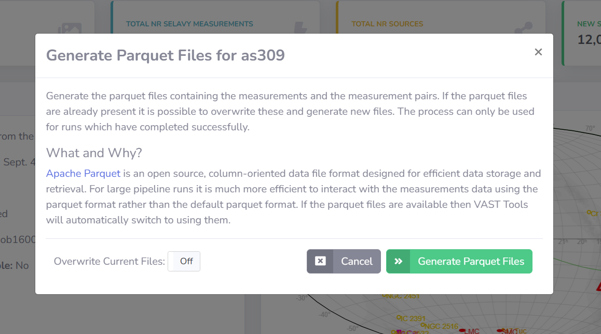
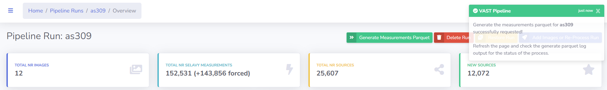
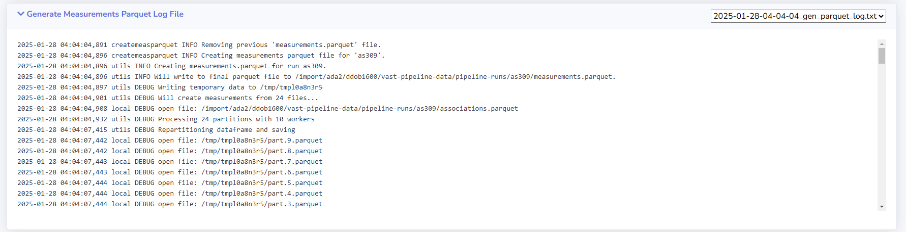

# Generating Parquet Files

This page describes how to generate the measurements parquet file for a pipeline run if the option in the configuration file to create it was turned off. This can only be run by the creator or an administrator.

The measurements file is an [Apache Parquet](https://parquet.apache.org/){:target="_blank"} format file containing all the measurements associated with the pipeline run (see [Parquet Files](#parquet-files)). Extra processing is performed in the creation of this file such that source ids are already in place for the measurements and the parquet file is partitioned sensibly. 

!!! tip "Measurements Parquet  Available"
    Users can see if the measurements parquet file is present for the run of interest by checking the respective run detail page.
    {: loading=lazy }
    

!!! tip "Admin Tip"
    The measurements parquet can be generated using the command line using the command [`createmeasparquet`](../adminusage/cli.md#createmeasparquet)).

## Why Create the parquet?

Large pipeline runs (thousands of images) mean that to read the measurements, thousands of parquet files need to be read in, and can contain tens millions of rows.
This can be slow or completely impossible using libraries such as pandas, due to the large amount of memory required.

Instead, if the measurements are saved in the [Apache Parquet](https://parquet.apache.org/){:target="_blank"} format, libraries such as [`dask`](https://www.dask.org/){:target="_blank"} are able to open `.parquet` files in an out-of-core context so the memory footprint is hugely reduced along with the reading of the file being very fast.

## Step-by-step Guide

### 1. Navigate to the Run Detail Page

Navigate to the detail page of the run you wish to generate parquet files for.

{: loading=lazy }

### 2. Select the Generate Measurements Parquet Option

Click the `Generate Measurements Parquet` option at the top-right of the page.

{: loading=lazy }

This will open the generate measurements parquet modal.

{: loading=lazy }

### 3. Submit Generate Measurements Parquet Request

It is possible to overwrite existing parquet files by toggling the `Overwrite Current Files` option.

When ready, click the `Generate Measurements Parquet` button on the modal to submit the generate request.
A notification will show to indicate whether the submission was successful.

{: loading=lazy }

### 4. Refresh and Check the Generate Measurements Parquet Log File

It is possible to check the progress by looking at the Generate Measurements Parquet Log File which can be found on the run detail page.
The log will not be refreshed automatically and instead the page needs to be manually refreshed.

Once completed the measurements parquet will be available for use.

{: loading=lazy }
