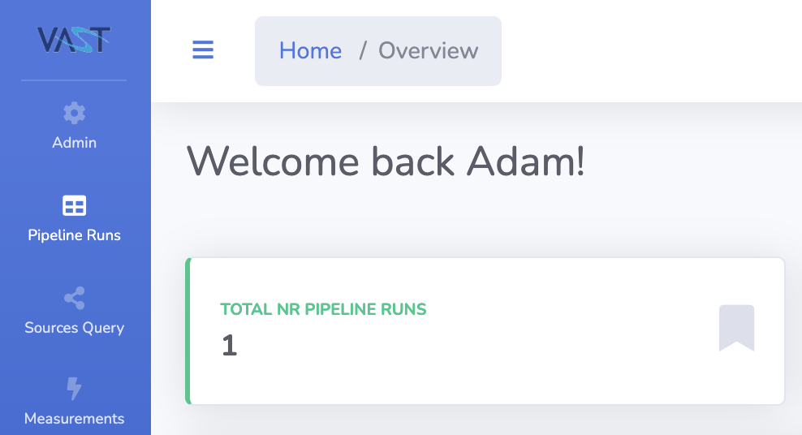
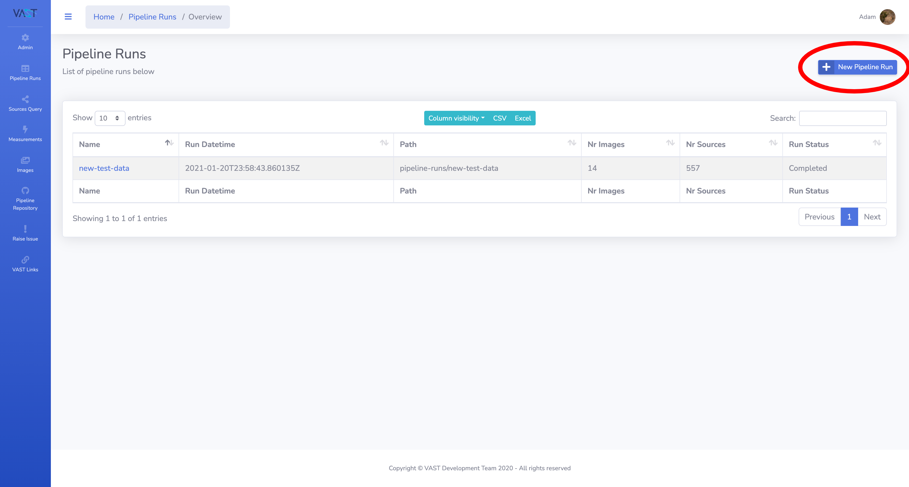
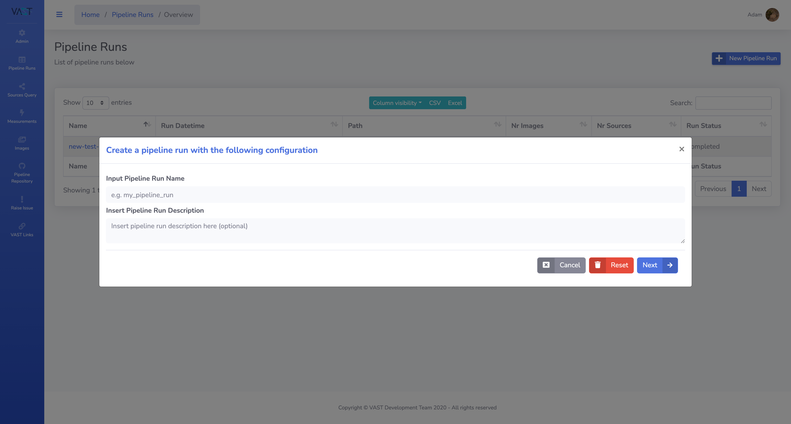
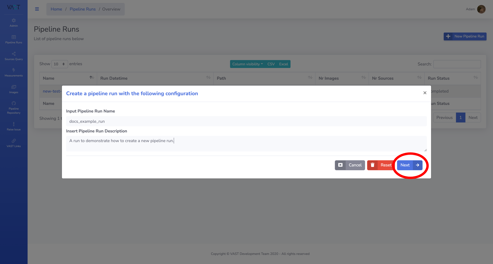
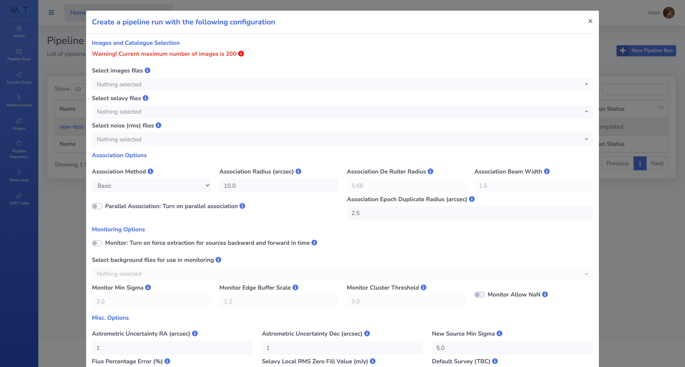
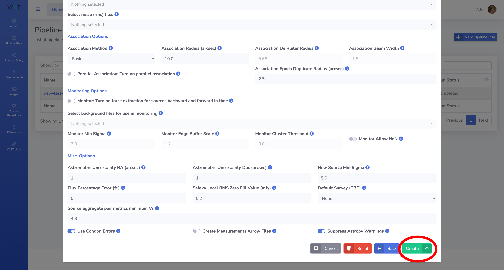
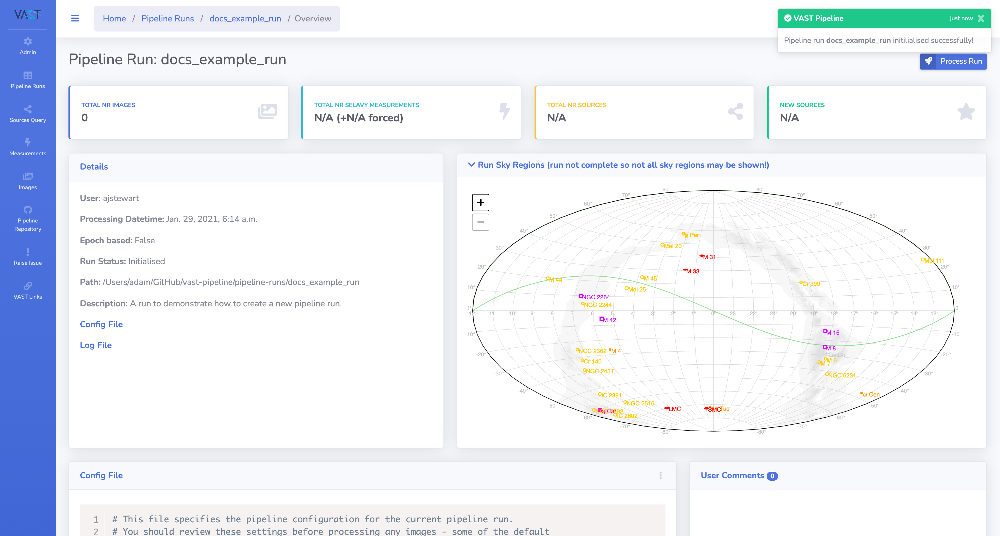

# Initialising a Pipeline Run

This page outlines the steps required to create a pipeline run through the web interface. A description of the run configuration options can be found in the [next section](runconfig.md).

!!! note
    Administrators please refer to [this section](../../adminusage/cli/#initialise-a-pipeline-run) in the admin documentation for instructions on how to initialise a pipeline run via the command line interface.
    
!!! warning
    No data quality control is performed by the pipeline. Make sure your input data is clean and error free before processing using your preferred method.

## Step-by-step Guide

### 1. Navigate to the Pipeline Runs Overview Page
Navigate to the Pipeline Runs overview page by clicking on the `Pipeline Runs` option in the left hand side navigation bar, as highlighted below.

[{: loading=lazy }](../img/piperuns-navbar.png)

### 2. Select the New Pipeline Run Option
From the Pipeline Runs overview page, select the `New Pipeline Run` button as highlighted in the screenshot below. This will open up a modal window to begin the run initialisation process.

[{: loading=lazy }](../img/piperuns-newrun.png)
[{: loading=lazy }](../img/initrun-modal1.png)

### 3. Fill in the Run Details
Fill in the name and description of the run and then press next to navigate to the next form to enter and select the configuration options.

For full details on how to configure a pipeline run see the [Run Configuration](runconfig.md) page, but a few notes here:

* Any settings entered here are not final, they can still be changed once the run is created.
* The order of the input files must match between the data types - i.e. the first selavy file, rms image and background image must all be the products of the first image, and so on.
* If you have a high number of images, selavy files, rms images and background images, it may be easier to leave these empty and instead use the text editor on the run detail page to directly enter the list to the configuration file.
* By default, non-admin users have a 200 image limit.

Once you have finished filling in the configuration options, press the `create` button.

[{: loading=lazy }](../img/initrun-modal2.png)
[{: loading=lazy }](../img/initrun-modal3.png)
[{: loading=lazy }](../img/initrun-modal4.png)

### 4. The Run Detail Page

After pressing create, the run will be initialised in the pipeline, which means the required configuration files have been created and the run is ready to be processed. You will be navigated to the detail page of the created run (shown below). On this page you can:

* View details of the run.
* View and edit the configuration file.
* Leave a comment about the run.
* View tables of associated images and measurements (once processed).
* Submit the run to be processed.

For full details on:

* how to use the text editor to edit the configuration file see [Run Configuration](runconfig.md),
* how to submit the job to be processed see [Processing a Run](processrun.md),
* and how to add images to a run that has already been processed [Adding Images to a Run](addtorun.md).

[{: loading=lazy }](../img/rundetail-create.png)
