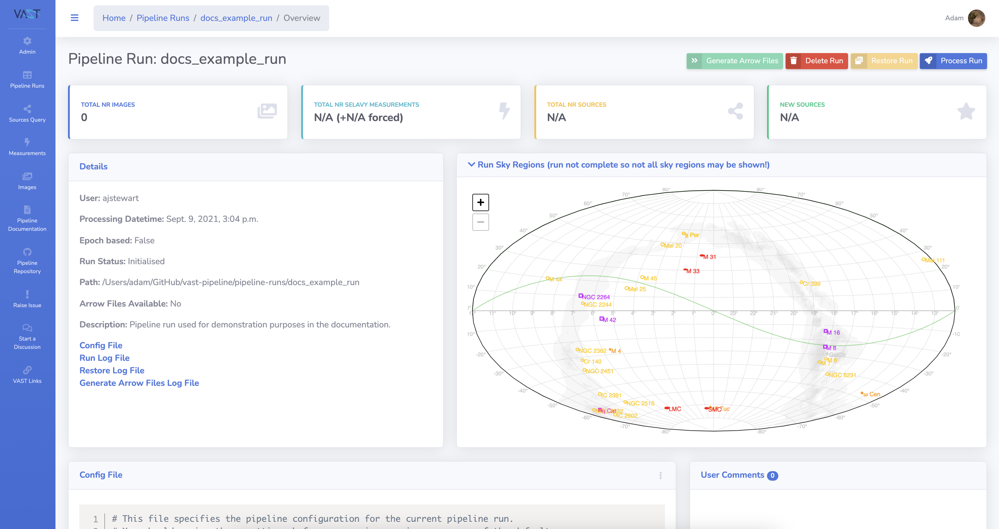
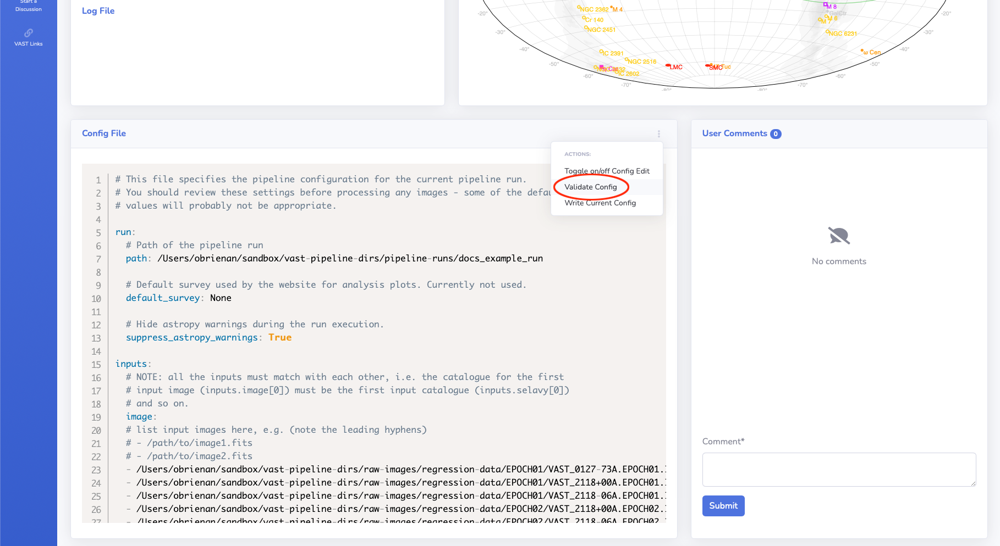
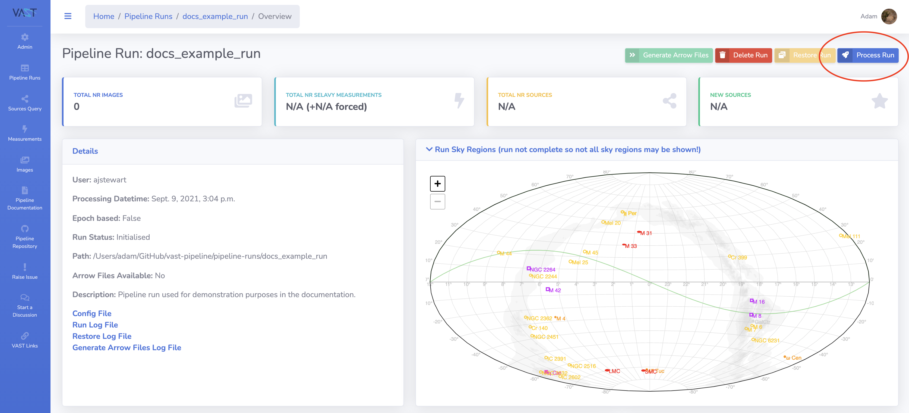
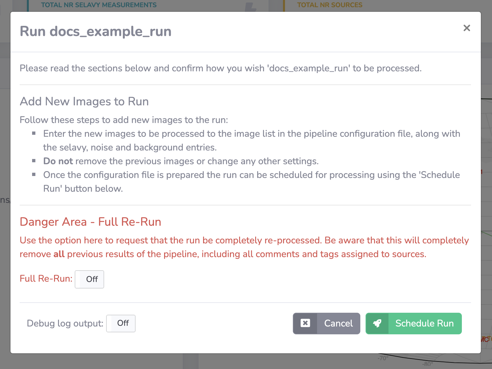

# Processing a Run

This page describes how to submit a pipeline run for processing.

!!! tip "Admin Tip"
    Administrators please refer to [this section](../../adminusage/cli/#runpipeline) in the admin documentation for instructions on how to process a pipeline run via the command line interface.

!!! warning "Admin Warning"
    The `Django Q` service must be running in order for pipeline runs to be processed. See the [Deployment](../quickstart/deployment.md#django-q) page for further details.

!!! tip
    Use the editor window on the run detail page to make adjustments to the run configuration file before processing.

## Step-by-step Guide

### 1. Navigate to the Run Detail Page
Navigate to the detail page of the run you wish to process.

[{: loading=lazy }](../img/run-detail.png)

### 2. Run a config validation
Before processing it is recommended to check that the configuration file is valid. This is done by scrolling down to the config file card on the page and selecting the `Validate Config` option accessed by clicking the three dots menu button. Doing this will check if the configuration contains any errors prior to processing.

Feedback will be provided on whether the configuration file is valid. In the event of an error, this can be corrected by using the edit option found in the same menu.

[{: loading=lazy }](../img/rundetail-validate-config.png)

[{: loading=lazy }](../img/rundetail-validate-config-feedback.png)

### 3. Confirm Processing
With a successful configuration validation, scroll back up to the top of the page and click the `Process Run` button. This will open a modal window for you to confirm processing.

For a newly initialised run, the only option that requires attention is whether to toggle the `Debug Log Output` on. This can be helpful if processing a new set of images which the pipeline hasn't seen before.

If you are processing a run that has errored in the initial processing then the `Full Re-Run` option should be toggled to `On`.

Once ready, press the `Schedule Run` button which will send the run to the queue for processing.

!!! warning
    For non-admin users, by default there is a run image limit of 200.

[{: loading=lazy }](../img/process-run-button.png)

[{: loading=lazy }](../img/process-run-modal.png)

[{: loading=lazy }](../img/process-run-success.png)

## Monitoring the Run
You can check the status of the run by refreshing the run detail page and seeing if the `Run Status` field has been updated. You can also check the log output by scrolling down to the log file card found below the configuration file.

There is currently no automated notification on completion or errors.

## Full Re-Run
A full re-run will be required if the run configuration needs to be changed, or in the event that an initial run has errored.

!!! warning
    The `Full Re-Run` option will **remove all associated existing data** for that run.

!!! note
    If images have been added to a run and the processing errors, there is a one time undo option that may avoid having to use the `Full Re-Run` command.

## Adding Images to a Run
See the dedicated documentation page [here](addtorun.md).
