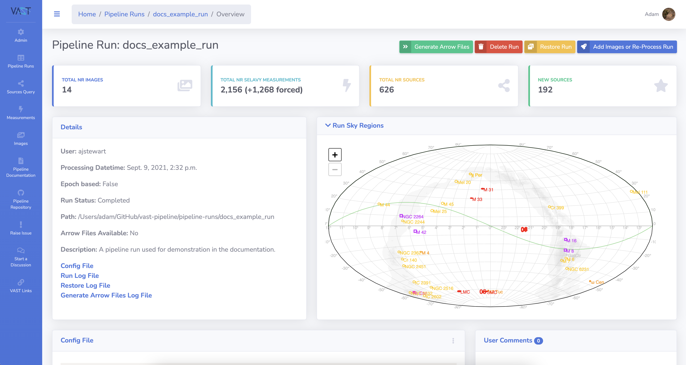

# Restoring a Run

This page details the process of restoring a pipeline run to the previous successful version.

When images are added to a run, a backup is made of the run before proceeding which can be used to restore the run to the pre-addition version. 
For example, perhaps the wrong images were added or an error occurred mid-addition that could not be resolved.

A pipeline run can only be restored by the creator or an administrator.

!!! tip "Admin Tip"
    This process can also be launched via the command line using the `restorepiperun` command. 
    It is described in the admin section [here](../../adminusage/cli/#restorepiperun).

!!! warning "Warning: One time use"
    This process can only be used to restore the run once. 
    I.e. it is not possible to restore the run to an even earlier version.

## Step-by-step Guide

In this example, the `docs_example_run` will be restored to the state before the images were added in the [Adding Images to a Run](addtorun.md) example.

### 1. Navigate to the Run Detail Page

Navigate to the detail page of the run you wish to restore.

{: loading=lazy }

### 2. Select the Restore Run Option

Click the `Restore Run` option at the top-right of the page.

{: loading=lazy }

This will open the restore confirmation modal.

{: loading=lazy }

### 3. Check the Restore Configuration

Shown in the modal is the configuration file of the previous successful run.
This can be used to check that the images listed here are those that are expected.

Debug level logging can also be turned on using the toggle button.

When ready, click the `Restore Run` button on the modal to submit the restore request.
A notification will show to indicate whether the submission was successful.

{: loading=lazy }

### 4. Refresh and Check the Restore Log File

While restoring the pipeline run will show a status of `Restoring`.
It is possible to check the progress by looking at the Restore Log File which can be found on the run detail page.
The log will not be refreshed automatically and instead the page needs to be manually refreshed.

Upon a successful restoration the status will be changed back to `Completed`.

{: loading=lazy }
